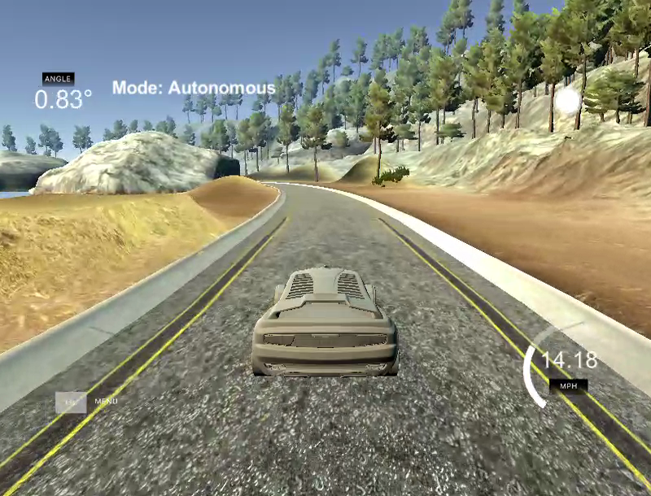

#**Behavioral Cloning Project**
## Udacity Self Driving Cars


The goals / steps of this project are the following:

1. Use the simulator to collect data of good driving behavior

2. Build, a convolution neural network in Keras that predicts steering angles from images

3. Train and validate the model with a training and validation set

4. Test that the model successfully drives around track one without leaving the road

5. Summarize the results with a written report


## Rubric Points
###Here I will consider the [rubric points](https://review.udacity.com/#!/rubrics/432/view) individually and describe how I addressed each point in my implementation.  

---
###Files Submitted & Code Quality

####1. Submission includes all required files and can be used to run the simulator in autonomous mode

My project includes the following files:

1. model.py containing the script to create and train the model
2. drive.py for driving the car in autonomous mode
3. model.h5 containing a trained convolution neural network 
4. this README.MD report summarizing the results


####2. Submission includes functional code
You can find the Udacity self-driving car simulator at [github link](https://github.com/udacity/self-driving-car-sim). 

I used at project [Windows 64 Version 1, 12/09/16](https://d17h27t6h515a5.cloudfront.net/topher/2016/November/5831f3a4_simulator-windows-64/simulator-windows-64.zip)

To run the code start the simulator in autonomous mode, open another shell and type

```
python drive.py model.h5
```

####3. Submission code is usable and readable

The model.py file contains the code for training and saving the convolution neural network. The file shows the pipeline I used for training and validating the model, and it contains comments to explain how the code works.

To train the model, I used data contained in a directory C:\11SDC.

You can change input data directory by changing parameters:

```
data_path = 'C:/11SDC'
```

```
data_log = '/driving_log.csv'
```

The model is then trained by typing

```
python model.py
```

###Explore Dataset

Each time we have capture the road situation we get smapshots of 3 images:

** Center view:**


** Left view:**


** Right view:**


The training track has some problematic areas, especially with missing lane lines, changing light conditionssharp, corners, exits, bridges etс.


###Model Architecture and Training Strategy

####1. An appropriate model architecture has been employed

We use CNN architecture to predict the steering angle of the simulator.

I tried different schemes including LeNet, NVIDIA and comma.ai architectures. But the best performance is in the following scheme.


I used data augmentation ideas that proposed Vivek Yadav in his [article](https://chatbotslife.com/using-augmentation-to-mimic-human-driving-496b569760a9#.4iywd3mzj).


At the very beginning we preprocess input images to shape 64x64x3. 

Images are normalized to the range [-1,1].

Then we use 4 convolutional layers with ReLU activations throughout the whole network. 

The first two convolutional layers use (8,8) kernels with (4,4) strides and 32 channels. 

The second convolutional layer use (8,8) kernels with (4,4) strides 64 channels. 

The third convolutional layer uses (4,4) kernels with (2,2) strides and 128 channels. 

THe fourth convolutional layer uses (2,2) kernels with (1,1) strides and 128 channels.

Then we use two fully connected layers with ReLU activations and dropout regularization before the layers. 

And finally we have a single neuron that provides the predicted steering angle. 


| Layer (type)                    | Output Shape      |    Param #   |  Connected to                     
|---------------------------------|-------------------|--------------|------------------------- 
| lambda_1 (Lambda)               | (None, 64, 64, 3) |    0          | lambda_input_1[0][0]             
| convolution2d_1 (Convolution2D) | (None, 16, 16, 32)  |  6176        | lambda_1[0][0]                   
| activation_1 (Activation)     |   (None, 16, 16, 32)   | 0           | convolution2d_1[0][0]            
| convolution2d_2 (Convolution2D) |  (None, 4, 4, 64)     | 131136    |  activation_1[0][0]               
| relu2 (Activation)              | (None, 4, 4, 64)     | 0          | convolution2d_2[0][0]            
| convolution2d_3 (Convolution2D) | (None, 2, 2, 128)    | 131200     | relu2[0][0]                      
| activation_2 (Activation)       | (None, 2, 2, 128)    | 0          | convolution2d_3[0][0]            
| convolution2d_4 (Convolution2D) | (None, 2, 2, 128)    | 65664      | activation_2[0][0]               
| activation_3 (Activation)       | (None, 2, 2, 128)    | 0          | convolution2d_4[0][0]            
| flatten_1 (Flatten)          |    (None, 512)          | 0          | activation_3[0][0]               
| dropout_1 (Dropout)           |   (None, 512)          | 0          | flatten_1[0][0]                  
| dense_1 (Dense)                |  (None, 128)          | 65664      | dropout_1[0][0]                  
| activation_4 (Activation)       | (None, 128)         |  0          | dense_1[0][0]                    
| dropout_2 (Dropout)             | (None, 128)        |   0          | activation_4[0][0]               
| dense_2 (Dense)                |  (None, 128)       |    16512      | dropout_2[0][0]                  
| dense_3 (Dense)                |  (None, 1)        |     129        | dense_2[0][0]                    
||||
| Total params: 416481


####2. Reduction of overfitting in the model

The model contains two dropout layers in order to reduce overfitting. 

The model was tested by running it through the simulator and ensuring that the vehicle could stay on the track.

To avoid overfitting we use EarlyStopping function to stop training when loss on validation set stop to decrease.

####3. Model parameter tuning

The model used an adam optimizer. I try to tune different parameterm for better results.
Also I collected more data in training mode, because there were problems at certain parts of tracks, especially at those:

**Problem areas**
_____


####4. Appropriate training data

Training data was chosen to keep the vehicle driving on the road. I used a combination of center lane driving and data augmentation:
1. Randomly choose training example to avoid sequence distortions
2. Randomly choose left, center or right image
2. Randomly shear horizontally for road bending simulation
3. Randomly crop image to simulate car offset
4. Randomly change brightness to simulate different lightning conditions
4. Randomly flip image helps us to simulate another direction on the road


I use 20% for data validation. I get the loss of 0.0053 on validation set.


Adam optimizer was used for training. 

I slightly modified the drive.py and added in it function crop_image(). The function crop image to comply with (64,64) shape used by our CNN.
I also changes the speed from 9 to 30 to see results faster.


## Results


The final step was to run the simulator to see how well the car was driving around track. At the end of the process, on impementing the generator the vehicle is able to drive autonomously around the track without leaving the road.

To run simulator with model trained type:

```
python drive.py model.json
```

Example of video output file ([github link to video](https://github.com/server321/CarND-Behavioral-Cloning-P3/video.mp4)).

Example of video output youtube (higher resolution and duration) ([youtube](https://youtu.be/JFjVzx-jqGw))


<a href="https://youtu.be/JFjVzx-jqGw" target="_blank"></a>